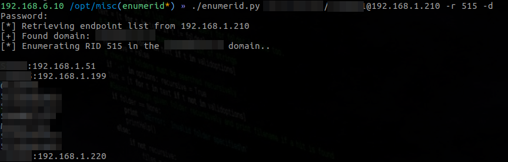
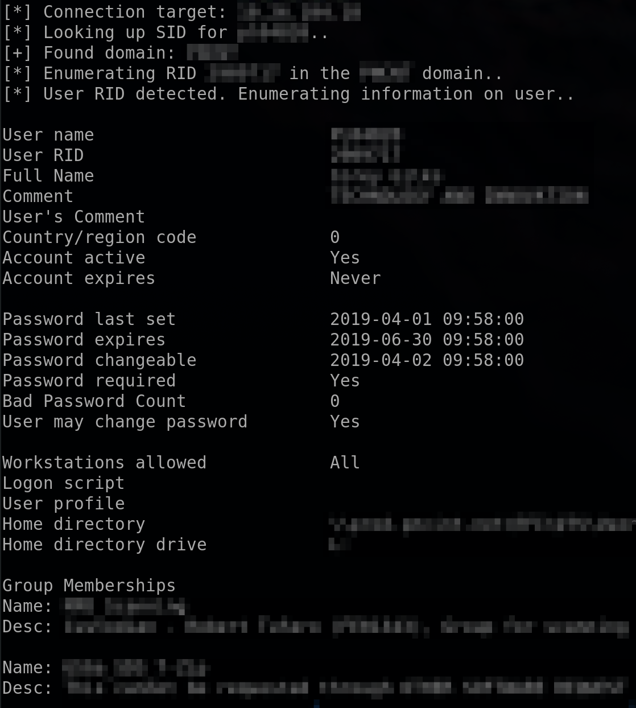

## Description
I created enumerid to help determine valid ranges in an environment after getting the intial foothold. Enumerid works by connecting over RPC and enumerating the Domain Computers group and then performing an IP lookup for the given hostname. If the host has a leased IP, you will get a resolution. This gives attackers the ability to more easily orient themselves in the network.

Rather than limiting the user to a single RID I decided to make it a bit more open ended and allow the user to specify arbitrary RIDs with the option to perform DNS resolution. So this script ended up being a more evolved version of enum4linux. The benefit of enumerid is that you can theoretically compile it into an exe and run it on Windows, although I have not personally tested this.

Enumerid can also work as a linux version of the "net user /domain" command and grab the domain password policy. See below for more details.

Commonly used RIDs can be displayed with the -h option. If you don't know the RID you can use the -s option to specify the string name of the user or group.

## Details
You can find the associated blog for this tool [here](https://gilks.github.io/post/enumerid/).

## Output
Enumerate domain computers with `-r` and resolve leased IPs with `-d`


`Net user ... /domain` command output with `-s username` or `-r username_rid`


Domain password policy enumeration with `-p`


## Requirements
The impacket library is required in order to run this script.
```
pip2 install impacket
```

If that fails, you can get the library from here.
```
https://github.com/CoreSecurity/impacket
```

## Example Usage:
Enumerate domain computers with DNS resolution:
```
./enumerid.py domain/username:password@<DC IP> -r 515 -d
```
Enumerate domain controllers without DNS resolution:
```
./enumerid.py domain/username:password@<DC IP> -r 516
```
Enumerate domain admins:
```
./enumerid.py domain/username:password@<DC IP> -r 512
```
Anonymous login vulnerability? Try this:
```
./enumerid.py domain/'':''@<DC IP> -r 515 -d
```

Enumerate without the RID (replace with your user/group name):
```
./enumerid.py domain/username:password@<DC IP> -s "Domain Admins"
```

Enumerate domain password policy
```
./enumerid.py domain/username:password@<DC IP> -p
```

Enumerate all domain users and descriptions
```
./enumerid.py domain/username:password@<DC IP> -u
```

Enumerate all domain group names and RIDs
```
./enumerid.py domain/username:password@<DC IP> -g
```